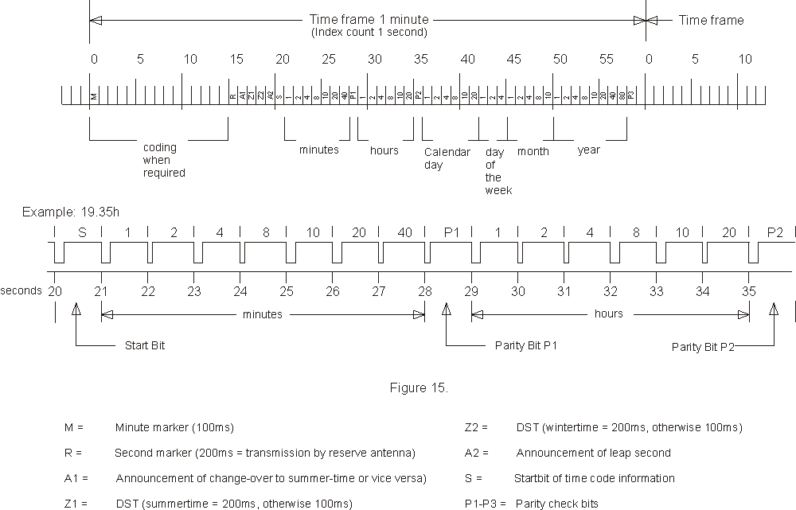

# DCF77 Arduino UNO R4 WiFi
A DCF77 time signal decoder running on Arduino UNO R4 WiFi.
The Arduino displays the current time on its LED matrix. A web-based interface gives access to the more recent signals.
## DCF77
The Wikipedia page describes [DCF77](https://en.wikipedia.org/wiki/DCF77) very well.
The long and the short is that DCF77 is a radio-based time signal. Local clocks sync to the radio signal automatically. Of course in 2025, there are many alternatives to sync clocks such as [NTP](https://en.wikipedia.org/wiki/Network_Time_Protocol) (on a WiFi board like the Arduino UNO R4 WiFi!) or [GPS signals](https://en.wikipedia.org/wiki/GPS_signals#Time). Unlike GPS, DCF77 is aware of daylight saving time.
DCF77 alarm clocks were popular last century, my late father-in-law had quite a collection. In 2025, new alarm clocks and watches are still on the market from manufacturers such as TFA Dostmann or Regent. Kits for hobbyists are also easy to find: a simple circuit board and a ferrite antenna.
## Genesis
By coincidence, I acquired a DCF77 watch recently. The watch needs a long while to sync and I became curious as to why. So I started reading about the DCF77 time-signal, its properties, etc.
The watch is a consumer product so its UI only exposes a single flag to indicate whether it received a signal or not. The geek was looking for more information.
I also had an Arduino UNO R4 WiFi laying around. Because it's a 5V board, the UNO R4 is a good match for DCF77 receivers. After discovering [dcf77Logs.de](https://www.dcf77logs.de), the idea of capturing local logs on the Arduino was born.
## The sketch
The DCF77 receiver is connected to digital pin 15. The sketch attaches an interrupt to measure the length of the pulses. A 0.1 sec pulse is binary 0, a 0.2 sec pulse is binary 1. One pulse per second, a full "frame" lasts one minute.

I wanted as little processing as possible in the interrupt so it  stores the bits in a buffer. Decoding takes places in the Arduino loop.
The LED matrix uses a second interrupt that flags the Arduino loop to start the next animation.
### Arduino loop
I want the Arduino loop to run at high frequency, so it is built around state machines. The loop itself is a state machine that execute two steps at each iteration:

 - update the RTC from a DCF77 time signal, if one is available
 - run one of the secondary algorithms, e.g. to blink the LED, update LED matrix or serve an http request

Of course, `delay()` is banned. Rather than waiting, the algorithms return to the main loop and use `millis()` on their next iteration to time themselves.
The secondary algorithms are either very fast (e.g. blink) or are broken down in atomic steps controlled by their own state machine (e.g. HTTP server).
In large algorithms, each atomic step executes a small portion of the logic, update its state and returns to the loop. The loop will rapidly call the algorithm again where it will execute the next step and so on.
The organisation of Arduino loop achieves three desirable properties:

 - updates to the RTC is high priority so the RTC is accurate
 - all other algorithm executes a high frequency so the board feels very responsive
 - the logic remains mono-threaded and reasonably easy to understand and debug

Being mono-threaded means that algorithms can rely on global/statically allocated memory instead of the stack or the heap. This shaves a few CPU cycles, small savings add up.

### TimeHistory
I debated long and hard on the data structure to store the time "frames" before writing the TimeHistory class. The data structure is highly specific to the constraints of this sketch.
The Renesas RA4M1 only has 32Kb of RAM. Each frame is 8 bytes long and there's a new frame every minute.
So I could store a less than 3 days of data in RAM… if there was no other demand on the memory! In practice I can fit a little over a day.
I considered solutions for compressing the data. After all, it only needs 59 bits out of the 64 available. And the year, month and day change at very low frequency. Even the hour could be optimised away from most records.
Is it worth the effort to keep several days of data in volatile RAM? I don't think so. I will look into compression again if/when I implement some form of permanent storage.
The TimeHistory balances these constraints. It's a FIFO rolling log. However I did not want the increased memory consumption of a linked list, nor the CPU cost of moving data around. It's implemented as an array with a moving pointer to the current location.
As the pointer reaches the end of the array, it rolls back to the beginning.
The sketch never needs to run more than one iteration at a time and the logic take advantage of that.
## DCF77 Receiver
After blowing a cheap receiver (I incorrectly wired the 5V to the output signal), I turned to the DCF-77 - type AT-513 from [Altel](http://altel.pl). The output is protected and it ships with a nice box, long cable and a LED that proved helpful during the initial development phase.
I'm sure that the sketch can be adapted to other receivers.
### Wiring
The board powers the receivers directly.
A pull-down resistor is required on the signal pin. Apparently the Renasas RA4M1 does not have pull-down on input pins.
Use the iPhone translator app to read the documentation that ships with your receiver. The English PDF version available online lays down different colours for the wiring (fortunately the output is protected).

### A word on electromagnetic interferences
Given that the watch fails to sync a couple of days a week, I expected low quality signal so I was bracing myself for an error-correction algorithm but it turns out that the reception is good in my area so I don't need much error correction at all.
The receiver however is very sensitive to electromagnetic interferences. Singularly including interferences produced by the Arduino board itself! You want the receiver at least 50cm away from the board.
One benefit of the Altel receiver is that it ships with a 3M cable.